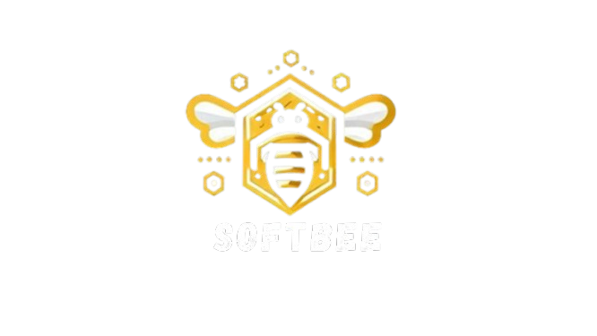

# 🐝 Softbee

<p align="center">
  
</p>

**Softbee** es una solución integral diseñada para el control y monitoreo avanzado de apiarios y colmenas. Desarrollada con los más altos estándares de ingeniería en **Flutter**, la aplicación permite a los apicultores gestionar su producción, salud de las colmenas y realizar un seguimiento detallado del entorno de manera eficiente y escalable.

---

## 🚀 Estado del Proyecto (Fase Actual)

Actualmente, el proyecto se encuentra en la **Fase de Desarrollo de Funcionalidades Core**. Se ha implementado la base arquitectónica y los módulos fundamentales:

- [x] **Arquitectura Base:** Estructura de Clean Architecture establecida.
- [x] **Core System:** Gestión de red (Dio), Rutas (GoRouter) y Tematización.
- [x] **Módulo de Autenticación:** Integración con seguridad local y almacenamiento persistente.
- [x] **Gestión de Apiarios:** Visualización y lógica de dominio básica.
- [x] **UI/UX Premium:** Implementación de animaciones (Lottie) y carga interactiva.

---

## 🏗️ Arquitectura

El proyecto sigue los principios de **Clean Architecture**, separando las responsabilidades en capas para garantizar un código testeable, mantenible y desacoplado:

### Capas del Proyecto:
1.  **Data:** Repositorios físicos, fuentes de datos (locales/remotas) y modelos (Mappers).
2.  **Domain:** La "verdad" del negocio. Contiene Entidades puras, Casos de Uso (Usecases) y definiciones de Repositorios (Interfaces).
3.  **Presentation:** Lógica de UI, Widgets, y gestión de estado.
4.  **Core:** Utilidades transversales, manejo de errores, temas y configuración global.

---

## 🛠️ Stack Tecnológico

| Herramienta | Propósito |
| :--- | :--- |
| **Flutter/Dart** | Framework de desarrollo UI y lenguaje base. |
| **Riverpod** | Gestión de estado reactivo y Inyección de Dependencias. |
| **GoRouter** | Navegación declarativa y manejo de rutas profundas. |
| **Dio** | Cliente HTTP avanzado para peticiones API. |
| **Lottie** | Animaciones vectoriales interactivas (JSON). |
| **Shared Preferences / Secure Storage** | Persistencia de datos local y almacenamiento sensible. |
| **Local Auth** | Autenticación biométrica (Huella/Rostro). |
| **Equatable / Either Dart** | Programación funcional y comparaciones de objetos. |

---

## 📂 Estructura de Carpetas

```text
lib/
├── core/              # Configuración global, temas, rutas y servicios compartidos.
│   ├── error/         # Definición de fallos y excepciones.
│   ├── network/       # Cliente Dio y configuración de red.
│   ├── router/        # AppRouter y definiciones de rutas.
│   └── theme/         # Colores, fuentes y estilos de la app.
├── feature/           # Módulos basados en funcionalidades (Screaming Architecture).
│   ├── apiaries/      # Dominio, Datos y Presentación de Apiarios.
│   ├── auth/          # Lógica de ingreso y seguridad.
│   ├── beehive/       # Gestión individual de colmenas.
│   └── monitoring/    # Visualización de datos y sensores.
└── main.dart          # Punto de entrada de la aplicación.
```

---

## ⚙️ Instalación y Configuración

Sigue estos pasos para ejecutar el proyecto en tu entorno local:

1.  **Clonar el repositorio:**
    ```bash
    git clone https://github.com/SoffiaSanchezz/Softbee-App.git
    cd Softbee
    ```

2.  **Configurar variables de entorno:**
    Crea un archivo `.env` basado en `.env.example` y añade tus credenciales/API keys.

3.  **Instalar dependencias:**
    ```bash
    flutter pub get
    ```

4.  **Generar código automático (si aplica):**
    ```bash
    dart run build_runner build --delete-conflicting-outputs
    ```

5.  **Ejecutar la aplicación:**
    ```bash
    flutter run
    ```

---

## 🎨 Identidad Visual

La aplicación utiliza una paleta de colores inspirada en la naturaleza y la apicultura profesional, con componentes personalizados como el **Honeycomb Loader** para una experiencia de usuario inmersiva.

- **Tipografía:** Google Fonts (Roboto/Oswald).
- **Animaciones:** `lottie`, `flutter_animate`.

---

<p align="center">
  Desarrollado con ❤️ para la comunidad apícola.
</p>
